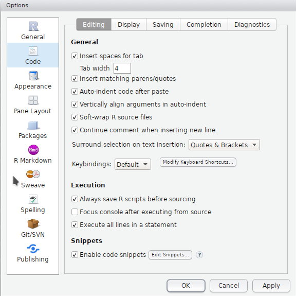
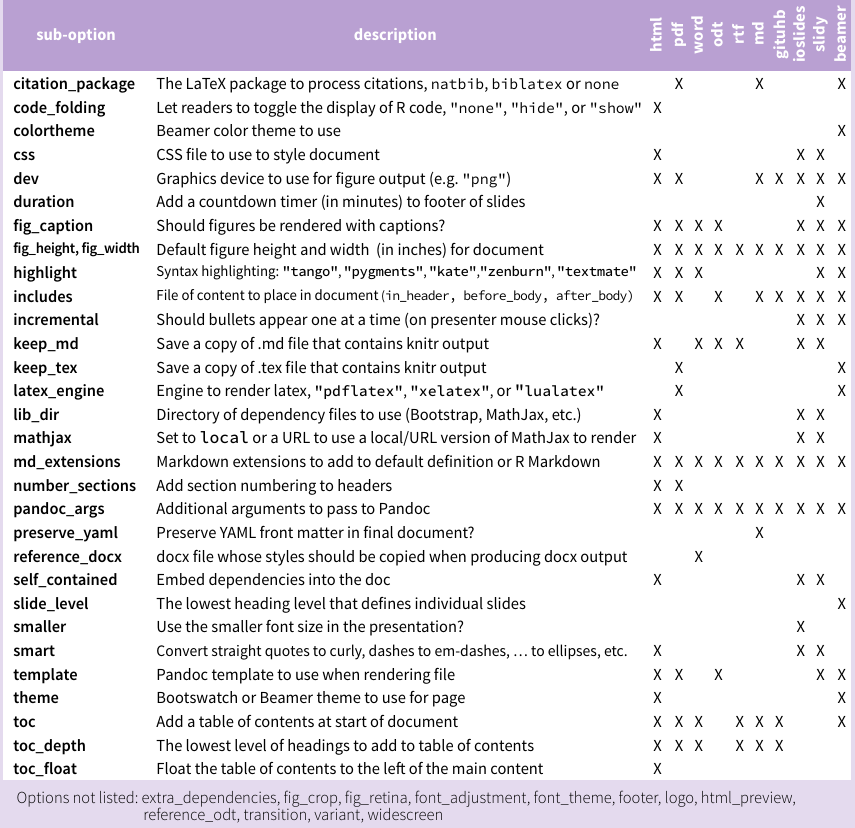
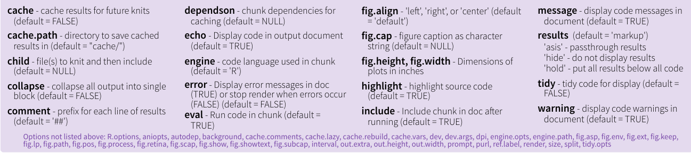

```{r setup, include=FALSE}
knitr::opts_chunk$set(echo = TRUE)
```

## R Markdown

This is an R Markdown presentation. Markdown is a simple formatting syntax for authoring HTML, PDF, and MS Word documents. For more details on using R Markdown see <http://rmarkdown.rstudio.com>.

When you click the **Knit** button a document will be generated that includes both content as well as the output of any embedded R code chunks within the document.

## Slide with Bullets

- Bullet 1
- Bullet 2
- Bullet 3

## Slide with R Output

```{r cars, echo = TRUE}
summary(cars)
```

## Slide with Plot

```{r pressure, echo = FALSE}
plot(pressure)
```

# Rstudio

## Global Options

<div class="column-left2">
  
</div>

<div class="column-right2">
  
</div>

# Markdown

## R Markdown Cheatsheet

Help > Cheatsheets > R Markdown Cheatsheet

"Pandoc's Markdown"

## Markdown


<div class="column-left2">
  <center>
  
  </center>
</div>

<div class="column-right2">
  <center>
  
  </center>
</div>

# R Markdown

## Getting Started with `Rmd` files

**Literate Programming**: interweaving code, its output, and regular prose text

<hr>

File > New File > R Markdown ...

<center>
  
</center>

## New `Rmd` File

<center>
  
</center>

## The YAML header

```YAML
---
title: 'Back to Basics'
subtitle: 'R you markDown?'
author: "Daniel Chen"
date: "June 26, 2017"
output: 
  revealjs::revealjs_presentation:
    theme: "night"
    highlight: "zenburn"
    css: styles.css
    self_contained: true
    reveal_options:
      slideNumber: true
      previewLinks: true
---
```

revealjs: http://rmarkdown.rstudio.com/revealjs_presentation_format.html

## Output

<center>
  
</center>

## Output Options

<center>
  
</center>


## Main Document

<center>
  
</center>

## R Chunks

#### Write:
```
```{r eval=TRUE}
n = 10
rnorm(n)
```
```

#### Output:

```{r}
n = 10
rnorm(n)
```

## Prose Text

The previous slide showed random draws from the normal distribution with `mean = 0` and `sd = 1`.

There were `r n` draws.

<hr>

We can either

1. manually type in the number, `n`
2. print the value of `n` in an r chunk.
```{r}
print(n)
```
3. Or we can run R code inline as so: \`r n\`

## Chunks

```
```{r}
# R code here
```
```

```
```{r chunk_name}
# R code here
```
```

```
```{r chunk_name, echo = TRUE}
# R code here
```
```

<center>
  
</center>

## Documented, repliciable/reproducible, and automatic

The `knit` button (`ctrl + shift + k`)

```r
rmarkdown::render(input,
                  output_format = NULL, output_file = NULL, output_dir = NULL,
                  output_options = NULL, intermediates_dir = NULL,
                  knit_root_dir = NULL,
                  runtime = c("auto", "static", "shiny", "shiny_prerendered"),
                  clean = TRUE,
                  params = NULL,
                  knit_meta = NULL, envir = parent.frame(),
                  run_pandoc = TRUE, quiet = FALSE, encoding = getOption("encoding"))
```

## Parameters

DEMO `01-parameters`

```YAML
---
title: "parameters"
author: "Daniel Chen"
date: ""
output: html_document
params:
  data: ""
---
```

## Parameterized Reports

#### Run in R/Rmd:

```r
```{r}
rmarkdown::render(input = '01-parameters/params.Rmd',
                  quiet = TRUE,
                  params = list(
                      data = 'cars'
                  ))
```
```

#### Run in the command line:

1. install: `pandoc` `pandoc-citeproc`
2. shell:

```bash
Rscript -e "rmarkdown::render(input = '01-parameters/params.Rmd',
                              params = list(data = 'mtcars'))"
```

# What else?

## RMarkdown Website

- http://rmarkdown.rstudio.com/lesson-1.html

- notebooks
- slides
- interactive documents
- dashboards
- websites
- books

# Notebooks

## R Notebook

http://rmarkdown.rstudio.com/r_notebooks.html

- `output: html_document` -> `output: html_notebook`
    - output visible immediately beneath the input.
    - R Markdown documen:, all the code is sent to the console at once
    - Notebook: one line at a time is sent
    - Slightly better error handling
    - “knit” vs “previewed”
    - preview does not execute any of your R code chunks
        - it simply shows you a rendered copy of the markdown in your document along with the most recent chunk output
    - `.nb.html`

## Other Languages (SQL)

DEMO `02-notebook`

```{r}
library(DBI)
library(RSQLite)

rm(list = ls())

con = dbConnect(SQLite(), dbname = "data/survey.db")
```

```
```{sql connection=con}
SELECT * from Person;
```
```

```{sql connection=con}
SELECT * from Person;
```

## Data into R

```
```{sql connection=con, output.var=df_sql}
SELECT * from Person;
```
```

## Data from R

```{r}
name = 'William'
```

```
```{sql connection=con, output.var=df_sql}
SELECT * from Person WHERE personal = ?name;
```
```

# Slides

## Not much more different than r markdown/notebooks

- html: ioslides
- html: slidy
- html: revealjs (`install.packages('revealjs')`)
- pdf: beamer

```YAML
output: 
  revealjs::revealjs_presentation
```

## HTML works too!

Markdown documents can also render `HTML`!

It's how I make a 2-column slide

```css
.column-left2{
  float: left;
  width: 50%;
  text-align: left;
}
.column-right2{
  float: right;
  width: 50%;
  text-align: left;
}
```

```html
<div class="column-left2">
  <center>
  Hello
  </center>
</div>

<div class="column-right2">
  <center>
  there!
  </center>
</div>
```

# Interactive Documents

## Intro to Shiny

DEMO `03-shiny_docs`

- Introduce the concepts of Shiny without the boilerplate
- Minimal `ui` code
- `server` code is not in a function

## Shiny Presentations

You can also have shiny apps run in a presentation like this!

No demo though.

# Dashboards

## flexdashboard

http://rmarkdown.rstudio.com/flexdashboard/

- Use R Markdown!
- Different layouts
    - row/column
    - storyboard
    - mobile

```YAML
---
title: "Row Orientation"
output: 
  flexdashboard::flex_dashboard
---
```

## Example 1


## Example 2


## Example 3


# Websites

## blogdown

- R Markdown and Hugo
- `devtools::install_github('rstudio/blogdown')`
    - `blogdown::install_hugo()`
    - `blogdown::new_site()`
        - RStudio projects
    - `blogdown::serve_site()`
- https://bookdown.org/yihui/blogdown/

# Books

## bookdown

- documentation: https://bookdown.org/yihui/bookdown/
- books: https://bookdown.org/

- `install.packages("bookdown")`
- `devtools::install_github("rstudio/bookdown")`

## Minimal Viable Product

DEMO `05-bookdown/01-minimal`

- In separate rstudio project
- https://github.com/yihui/bookdown-minimal

```
---
title: "A Book"
author: "Frida Gomam"
site: bookdown::bookdown_site
documentclass: book
output:
  bookdown::gitbook: default
  bookdown::pdf_book: default
---

# Hello World

Hi.

Bye.

```

`bookdown::render_book('index.Rmd', 'all')`

rendered book will be under `_book`

## bookdown-demo

- code: https://github.com/rstudio/bookdown-demo
- rendered: https://bookdown.org/yihui/bookdown-demo/

`bookdown::render_book('index.Rmd', 'all')`

## M-K vs K-M

- “Merge and Knit” (M-K): default
- “Knit and Merge” (K-M): `new_session = TRUE` or `new_session: yes`

- K-M does not allow Rmd files to be in subdirectories, but M-K does.

# Misc

## Working directory

#### Notebooks

- chunk is always the directory containing the notebook .Rmd file.
- allows for same behaviour while knitting and in interactive mode
- get a warning if you try to change the working directory inside a notebook chunk
- revert back to the notebook’s directory once the chunk is finished executing

- use the `knitr` `root.dir` option
    - `knitr::opts_knit$set(root.dir = normalizePath(".."))`
    - only applies to chunks
    - relative paths in Markdown are still relative to the notebook’s parent folder

## Working directory

#### RMarkdown

```r
if (interactive()){
    data_dir <- './data'
} else {
    data_dir <- '../data'
}
```

feedback needed: https://github.com/chendaniely/rendR

## Other things to look at/consider
- Get verbatim R chunks into R Markdown:  
    http://rmarkdown.rstudio.com/articles_verbatim.html
- `sweave` and `knitr`:  
    https://support.rstudio.com/hc/en-us/articles/200552056-Using-Sweave-and-knitr
- `sweave` child documents example:  
    https://github.com/chendaniely/wicer-entice3

# Thanks!

## Thanks!

- @chendaniely
- https://github.com/chendaniely/2017-06-26-meetup-r_you_markDown
