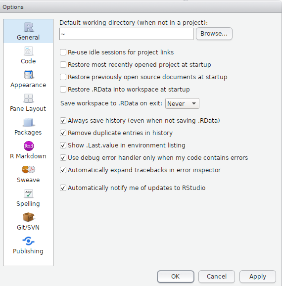
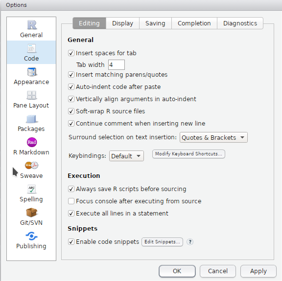
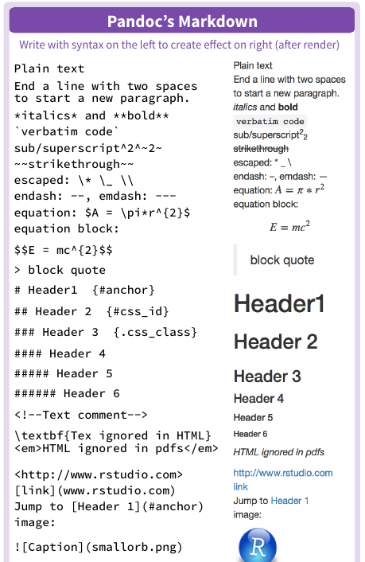
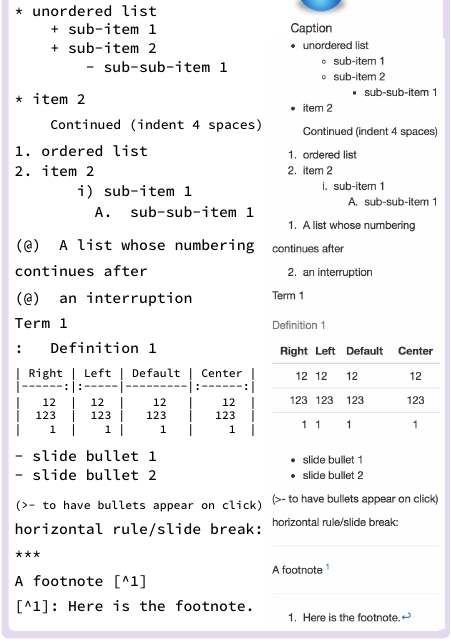
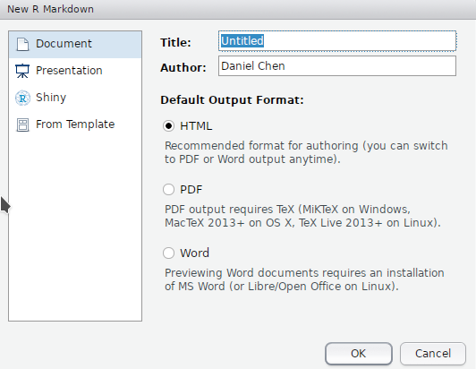
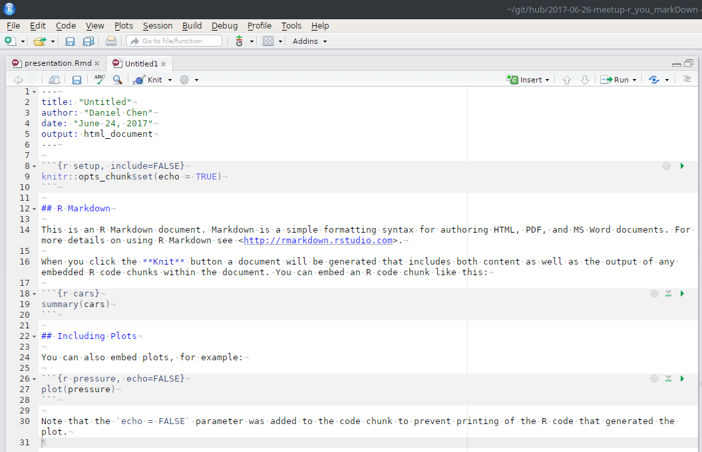
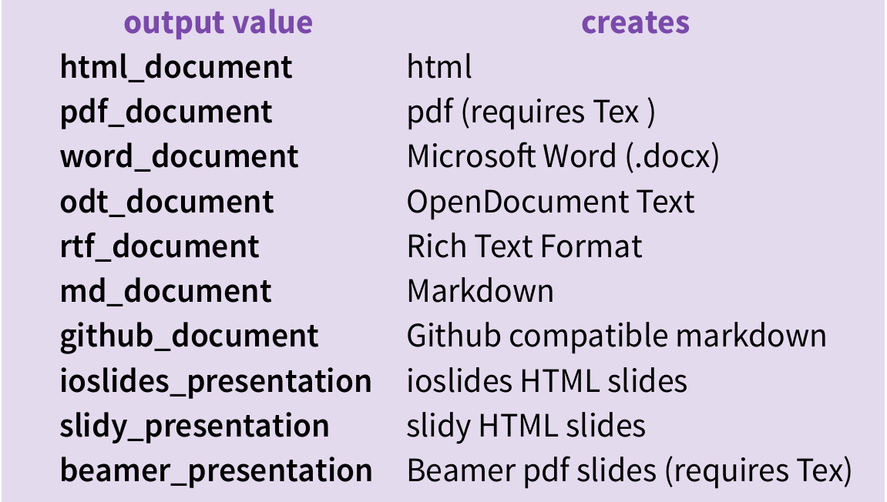
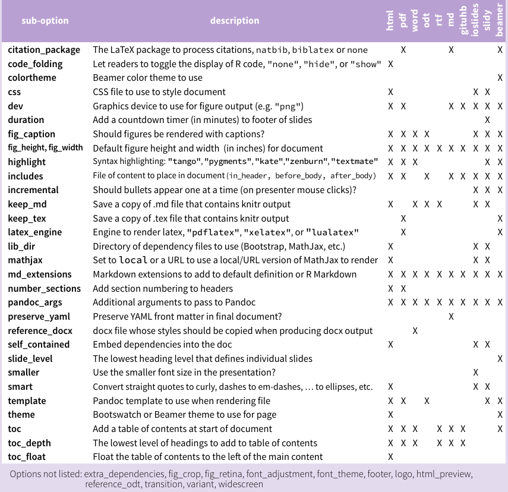

# Back to Basics
Daniel Chen  
June 26, 2017  


<style>
.column-left2{
  float: left;
  width: 50%;
  text-align: left;
}
.column-right2{
  float: right;
  width: 50%;
  text-align: left;
}
</style>

## R Markdown

This is an R Markdown presentation. Markdown is a simple formatting syntax for authoring HTML, PDF, and MS Word documents. For more details on using R Markdown see <http://rmarkdown.rstudio.com>.

When you click the **Knit** button a document will be generated that includes both content as well as the output of any embedded R code chunks within the document.

## Slide with Bullets

- Bullet 1
- Bullet 2
- Bullet 3

## Slide with R Output


```r
summary(cars)
```

```
##      speed           dist       
##  Min.   : 4.0   Min.   :  2.00  
##  1st Qu.:12.0   1st Qu.: 26.00  
##  Median :15.0   Median : 36.00  
##  Mean   :15.4   Mean   : 42.98  
##  3rd Qu.:19.0   3rd Qu.: 56.00  
##  Max.   :25.0   Max.   :120.00
```

## Slide with Plot

<!-- -->

# Rstudio

## Global Options

<div class="column-left2">
  
</div>

<div class="column-right2">
  
</div>

# Markdown

## R Markdown Cheatsheet

Help > Cheatsheets > R Markdown Cheatsheet

"Pandoc's Markdown"

## Markdown


<div class="column-left2">
  <center>
  
  </center>
</div>

<div class="column-right2">
  <center>
  
  </center>
</div>

# R Markdown

## Getting Started with `Rmd` files

File > New File > R Markdown ...

<center>
  
</center>

## New `Rmd` File

<center>
  
</center>

## The YAML header

```YAML
---
title: 'Back to Basics'
subtitle: 'R you markDown?'
author: "Daniel Chen"
date: "June 26, 2017"
output: 
  ioslides_presentation: 
    keep_md: yes
    smaller: no
    widescreen: no
---
```

## Output

<center>
  
</center>

## Output Options

<center>
  
</center>
